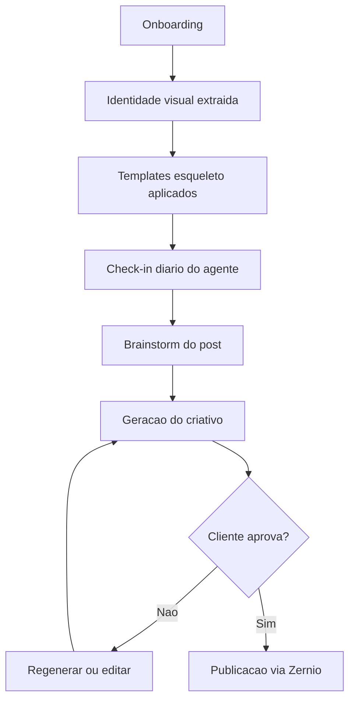

# Sollun — Mapa de Conteúdo

Ponto de entrada do segundo cérebro do projeto. Cada nota abaixo cobre um pedaço da operação.

> [!abstract] Em uma frase
> A Sollun é uma plataforma de **marketing automatizado por IA** para pequenos negócios — gera, edita e publica criativos, com aprovação do dono do negócio por chat ou pelo SaaS.

## Estratégia

- [[01 - Posicionamento e Escopo]]
- [[02 - Publico-Alvo e ICP]]
- [[03 - Regras do Projeto]]
- [[15 - Aquisicao e Clientes Fundadores]]

## Produto

- [[07 - Modelo de Dados - Post em Camadas]]
- [[08 - Fluxo de Criacao de Criativo]]
- [[09 - Onboarding e Identidade Visual]]
- [[19 - Identidade Visual - Referencia Antiga]]

## Técnico

- [[04 - Arquitetura Geral]]
- [[05 - Infraestrutura e VPS]]
- [[06 - Stack de Componentes]]
- [[10 - Integracao Instagram e Zernio]]
- [[11 - Agente Claude SDK e trigger.dev]]
- [[18 - Stack Frontend]]

## Negócio

- [[12 - Planos e Creditos]]
- [[13 - Custos e Margem]]
- [[14 - Juridico e Pagamentos]]

## Meta

- [[16 - Riscos e Pontos em Aberto]]
- [[17 - Ideias Descartadas]]

