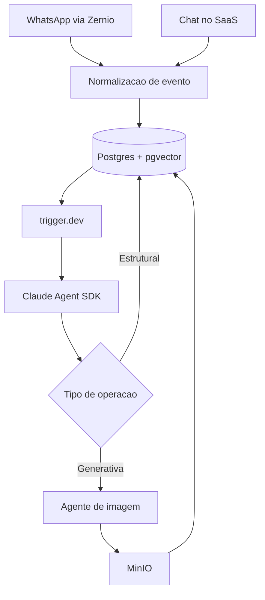

# Arquitetura Geral

## Princípio central

==Fonte única de verdade no banco.== WhatsApp e SaaS são **interfaces finas** sobre o mesmo estado — nenhum canal guarda estado próprio.

Isso significa que o cliente pode começar um brainstorm pelo WhatsApp e terminar aprovando no SaaS (ou o contrário) sem handoff, sem "quer continuar de onde parou?", sem duas versões do mesmo post divergindo.

> [!tip] Consequência prática
> Toda mensagem recebida, de qualquer canal, passa por uma camada de normalização e vira o **mesmo tipo de evento** contra o **mesmo registro** no Postgres. Nenhuma lógica especial por canal.

## Camadas

## Divisão de responsabilidade

| Peça | Responsabilidade |
|---|---|
| trigger.dev | Durabilidade: agenda, dispara, faz retry, retoma job pausado |
| Claude Agent SDK | Raciocínio e ação dentro de cada execução |
| Postgres | Estado de verdade de tudo |
| MinIO | Arquivo binário (imagem gerada) |
| Zernio | Fala com o mundo externo (WhatsApp, Instagram) |

> [!note] Por que os dois juntos
> O Agent SDK não tem persistência embutida — sessão não sobrevive a restart. O trigger.dev cobre exatamente esse buraco. Ver [[11 - Agente Claude SDK e trigger.dev]].
