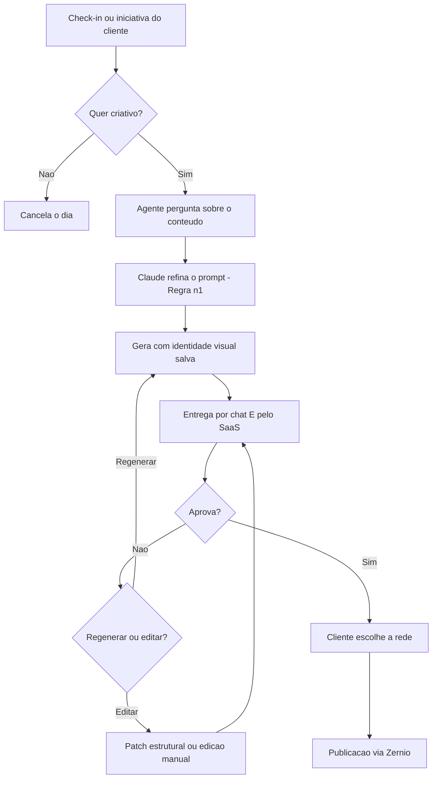

# Fluxo de Criação de Criativo

## Gatilho

Dois caminhos, ambos válidos:

1. **Check-in diário do agente** — "hoje tem criativo?"
2. **Iniciativa do cliente** — "tive uma ideia de post sobre X"

> [!warning] Template do WhatsApp
> O check-in é **mensagem iniciada pela empresa**, fora da janela de 24h de atendimento. Na API oficial isso exige **template pré-aprovado**. Aprovar esse template antes do lançamento, senão a mensagem é bloqueada. Ver [[10 - Integracao Instagram e Zernio]].

## Passo a passo

## Detalhes que importam

- O contexto do cliente extraído no onboarding evita que o agente sugira pauta fora de contexto.
- Aprovação acontece **por chat e pelo SaaS nativo** — o produto não depende só do WhatsApp.
- Na reprovação, o agente sempre oferece a saída barata primeiro: editar manualmente ou por patch estrutural, sem queimar token.

## Relacionadas

- [[07 - Modelo de Dados - Post em Camadas]]
- [[03 - Regras do Projeto]]
- [[12 - Planos e Creditos]]
